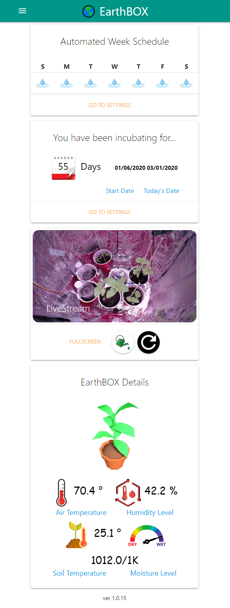
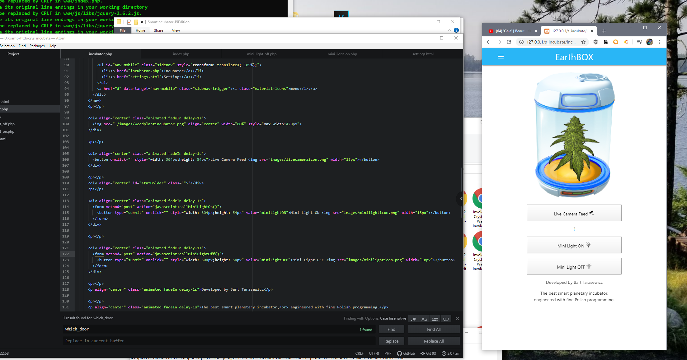
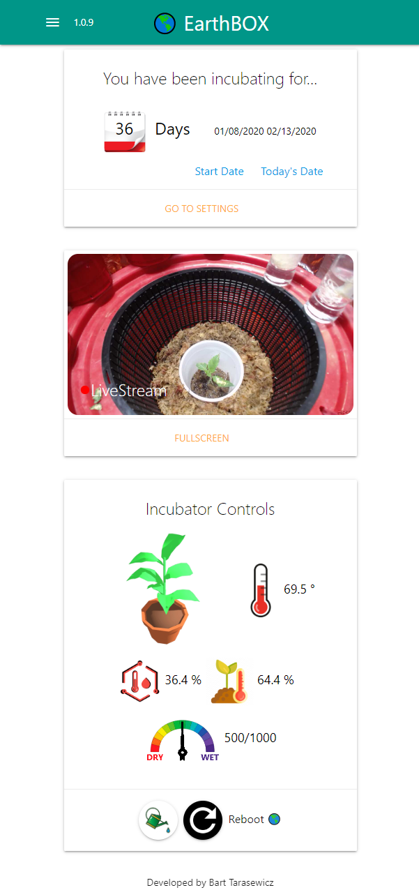

# Welcome to EarthBOX

ver 1.0.15

**What is it?**
EarthBOX is software engineered professionally by Bart Tarasewicz that offers users and developers to quickly
dispatch onto their raspberry pi for projects like incubation for their plants. Schedule times to activate the
water pump, night light, camera live stream and more!

